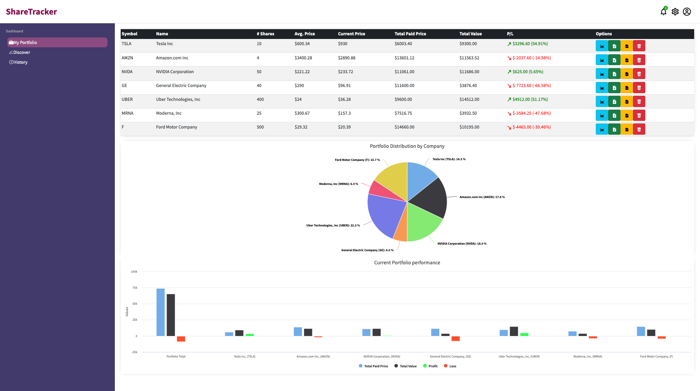
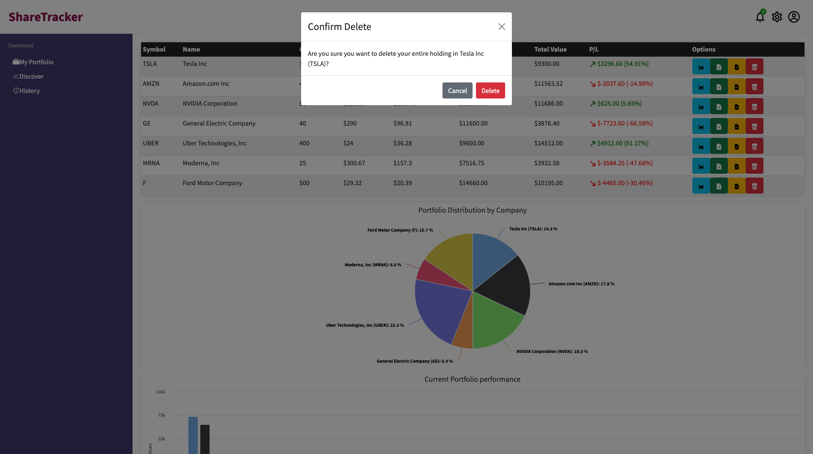

# Portfolio Tracker
The Portfolio Tracker app allows a user to track their shareholdings performance and total portfolio value in real-time. The "Discover" page allows a user to select a number of stocks provided by the external API, real-time data comes from the NASDAQ stock exchange. User is able to compare different stocks, add them to their portfolio and track the total portfolio value in real-time which is displayed on "My Portfolio" page.

This is a group project, a full-stack web app using JavaScript and React front-end, Express server, and MongoDB database back-end.


## Video Demo and Screenshots

Demo: https://youtu.be/f05D_Hy-H0Y


Portfolio / Home Page






Discover Page


## Project brief
A local trader has come to you with a portfolio of shares. She wants to be able to analyse it more effectively. She has a small sample data set to give you and would like you to build a Minimum Viable Product that uses the data to display her portfolio so that she can make better decisions.

## MVP
A user should be able to:

- view total current value.
- view individual and total performance trends.
- retrieve a list of share prices from an external API and allow the user to add shares to her portfolio.
- View a chart of the current values in her portfolio.

## Extensions
- View current share price of individual shareholdings.
- View average and total paid prices of individual shares in the portfolio.
- View a chart of total paid price, total value, profit, or loss.
- Implement a search box to find a specific stock from an external API.
- Temporarily add searched and selected stock to compare.
- Display line chart for share price performance over last 3 months.

## API, Libraries, Resources
- https://financialmodelingprep.com/ (Requires an account)
- https://www.highcharts.com/ HighCharts is an open-source library for rendering responsive charts.
- https://reactjs.org/
- https://expressjs.com/
- https://www.mongodb.com/
- https://nodejs.org/en/

#
## The project is built using:
* JavaScript
* React (front-end)
* Express (server)
* MongoDB (back-end)
* HTML / CSS
* Additional libraries used: HighCharts, Bootstrap
The application is using Financial Modeling Prep API as a source of stock data: https://financialmodelingprep.com/developer/docs/

## Project set up

| Front-end (client) | Back-end (server)    |
| :---               | :---                 |
| `npm install`      | `npm install`        |
| `npm start`        | `npm run seeds`      |
|                    | `npm run server:dev` |

To run this application locally, sign-up to get a free API key kere: https://financialmodelingprep.com/. Then inside ``` client/src/services ``` folder create a new file ```apikey.js```. Inside this file insert the line from bellow adding your API key where indicated:

```
export const apikey = "API_key_here"
export const apikeyPH = "API_key_here"
```